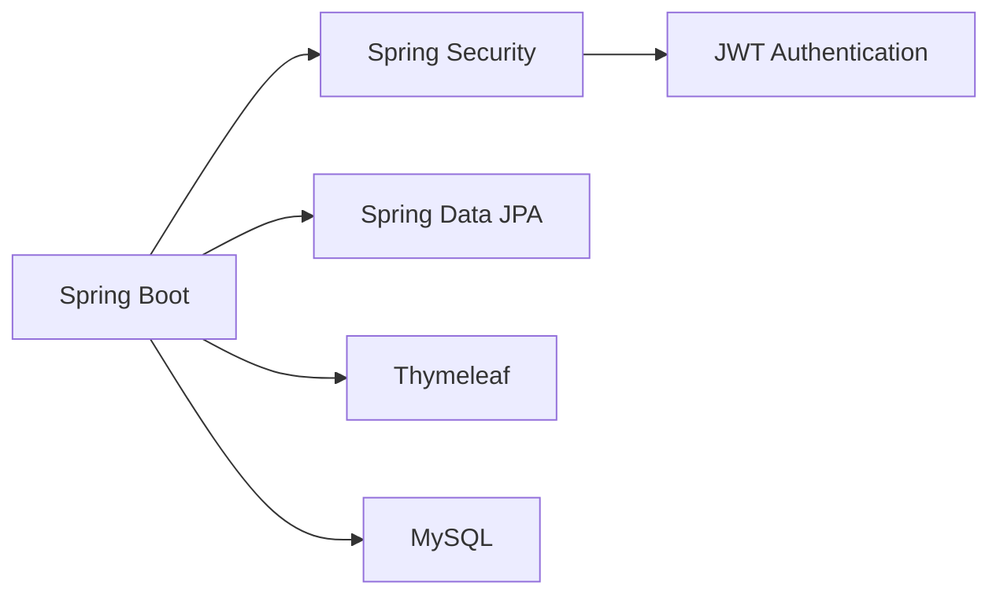

<div align="center">

# 🔗 URL Shortener

[](https://spring.io/projects/spring-boot)
[](https://www.oracle.com/java/)
[](LICENSE)
[](https://jwt.io/)

> *A Modern URL Shortening Service with Advanced Security Features*

[🎯 Overview](#-overview) •
[🌟 Features](#-features) •
[💻 Tech Stack](#-tech-stack) •
[📦 Installation](#-installation) •
[📖 Documentation](#-documentation) •
[👨‍💻 Author](#-author)

</div>

## 🎯 Overview

The URL Shortener is a robust Spring Boot application designed to provide secure and efficient URL shortening services. It offers a comprehensive solution for managing shortened URLs with advanced security features and user management capabilities.

The system allows users to:
- Register and authenticate securely using JWT
- Create and manage shortened URLs
- Track URL usage and analytics
- Maintain a personal URL library
- Access a user-friendly web interface

## 🌟 Features

<table>
<tr>
<td>

### 🔐 Security & Access
- JWT-based authentication
- Role-based access control
- Secure API endpoints
- Structured error handling
- Session management with secure cookies
- CSRF protection

</td>
<td>

### 🔗 URL Management
- URL shortening and redirection
- Custom alias support
- URL expiration settings
- Usage analytics tracking
- Active/Inactive URL status
- Pagination support

</td>
</tr>
<tr>
<td>

### 👤 User Features
- User registration and login
- Profile management
- Personal URL dashboard
- Activity history
- Role-based permissions
- User management (CRUD)

</td>
<td>

### ⚡ Development
- Hot reload support
- Comprehensive logging
- Error tracking
- DevOps-ready configuration
- Thymeleaf templating
- Responsive UI design

</td>
</tr>
</table>

## 💻 Tech Stack

### Core Framework & Security


### Key Components
- **Backend Framework**: Spring Boot 3.4.5
- **Database**: MySQL 8.0+
- **Authentication**: JWT with Spring Security
- **Templating**: Thymeleaf 3.1.1
- **Utilities**: Lombok, MapStruct
- **Validation**: Spring Validation
- **Logging**: SLF4J with DEBUG level

## 📦 Installation

### Prerequisites
- Java 17+
- Maven 3.6+
- MySQL 8.0+

### 🚀 Getting Started
1. **Clone Repository**
```bash
git clone https://github.com/sumanbisunkhe/urlshortner.git
cd urlshortner
```

2. **Configure Database**
   Create `application.properties`:
 ```properties
# Application Configuration
spring.application.name=urlshortner
app.base-url=http://localhost:8080/

# MySQL Database Configuration
spring.datasource.url=jdbc:mysql://localhost:3306/urlshortner_db
spring.datasource.username=your_username
spring.datasource.password=your_password
spring.datasource.driver-class-name=com.mysql.cj.jdbc.Driver

# Hibernate JPA Configuration
spring.jpa.hibernate.ddl-auto=update
spring.jpa.show-sql=true
spring.jpa.properties.hibernate.dialect=org.hibernate.dialect.MySQL8Dialect

# JWT Configuration
jwt.secret=your-secret-key
jwt.access-token-expiration=86400000
jwt.refresh-token-expiration=2592000000

# Logging Configuration
logging.level.com.example.urlshortner=DEBUG
logging.level.org.springframework.security=DEBUG

# Thymeleaf Configuration
spring.thymeleaf.cache=false
spring.thymeleaf.enabled=true

# Security Configuration
server.servlet.session.cookie.secure=false
server.servlet.session.cookie.http-only=true
server.servlet.session.cookie.same-site=lax
```

3. **Build & Run**
```bash
mvn clean install
mvn spring-boot:run
```

## 🗂️ Project Structure

```
src/main/java/com/example/urlshortner/
├── config/           # Configuration classes
├── controller/       # REST and MVC controllers
├── dto/             # Data Transfer Objects
├── enums/           # Enumeration types
├── exception/       # Custom exception handling
├── mapper/          # MapStruct mappers
├── model/           # Entity classes
├── repository/      # JPA repositories
├── security/        # Security configuration
├── service/         # Business logic
└── util/            # Utility classes

src/main/resources/
├── static/          # Static resources
├── templates/       # Thymeleaf templates
└── application.properties
```

## 🔧 Core Dependencies

<table>
<tr><th>Category</th><th>Dependencies</th></tr>
<tr>
<td>Core</td>
<td>

- spring-boot-starter-web
- spring-boot-starter-data-jpa
- spring-boot-starter-security
- spring-boot-starter-thymeleaf
- spring-boot-starter-validation
- spring-boot-devtools

</td>
</tr>
<tr>
<td>Security</td>
<td>

- jjwt-api
- jjwt-impl
- jjwt-jackson
- thymeleaf-extras-springsecurity6

</td>
</tr>
<tr>
<td>Database</td>
<td>

- mysql-connector-j

</td>
</tr>
<tr>
<td>Utilities</td>
<td>

- lombok
- mapstruct
- mapstruct-processor
- lombok-mapstruct-binding

</td>
</tr>
</table>

## 📖 Documentation

### API Endpoints

#### Authentication
- `POST /api/auth/register` - Register a new user
- `POST /api/auth/login` - User login
- `POST /api/auth/refresh-token` - Refresh JWT token

#### URL Management
- `POST /api/urls` - Create a new short URL
- `GET /api/urls` - List all URLs for authenticated user
- `GET /api/urls/{id}` - Get URL details
- `PUT /api/urls/{id}` - Update URL
- `DELETE /api/urls/{id}` - Delete URL
- `GET /{shortUrl}` - Redirect to original URL

#### User Management
- `GET /api/users/profile` - Get user profile
- `PUT /api/users/profile` - Update user profile
- `GET /dashboard/users` - List all users (Admin)
- `POST /dashboard/users` - Create new user (Admin)
- `PUT /dashboard/users/{id}` - Update user (Admin)
- `DELETE /dashboard/users/{id}` - Delete user (Admin)

### Web Interface
- `/dashboard` - User dashboard
- `/dashboard/profile` - User profile
- `/dashboard/users` - User management (Admin)
- `/login` - Login page
- `/register` - Registration page

## 🤝 Contributing

Contributions are welcome! Please feel free to submit a Pull Request.

1. Fork the repository
2. Create your feature branch (`git checkout -b feature/AmazingFeature`)
3. Commit your changes (`git commit -m 'Add some AmazingFeature'`)
4. Push to the branch (`git push origin feature/AmazingFeature`)
5. Open a Pull Request

## 👨‍💻 Author

<div align="center">

### Suman Bisunkhe
Java Developer

[](https://github.com/sumanbisunkhe)
[](mailto:sumanbisunkhe304@gmail.com)
</div>

## 📄 License

This project is licensed under the MIT License - see the [LICENSE](LICENSE) file for details.

---

<div align="center">

Made with ❤️ by [Suman Bisunkhe](https://github.com/sumanbisunkhe)

</div> 